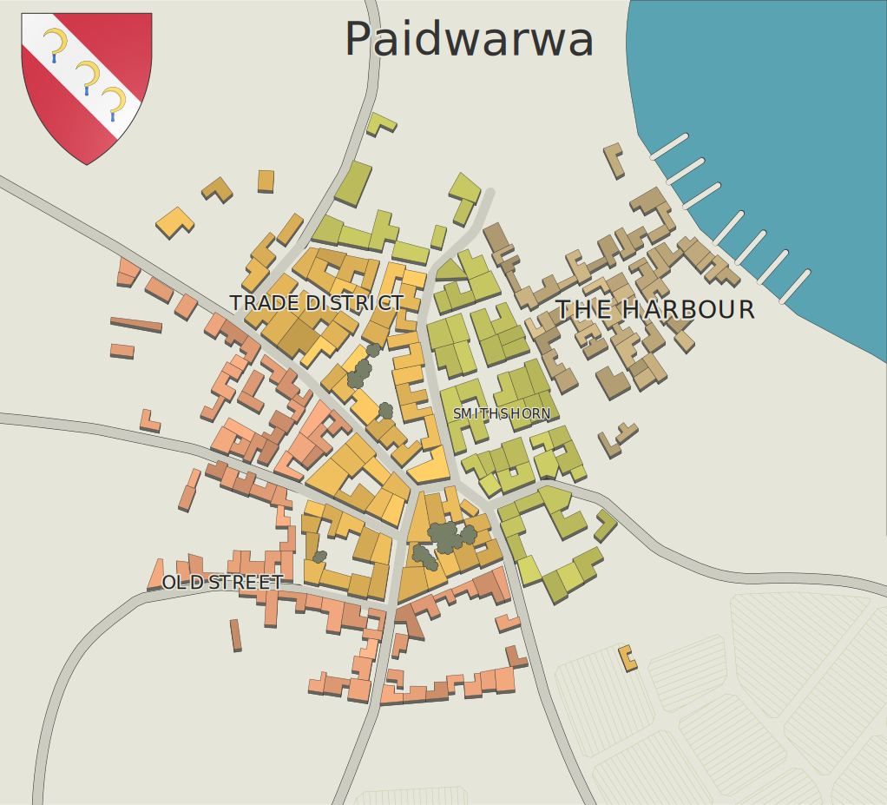

# Paidwarwa

Paidwarwa is one of the three harbour cities of [Velandra](./Velandra.md), located on the eastern side of the island. There are a total of four districts here. Because it is located so close to [Praxidon](./Praxidon.md), most of its newer buildings are made of stone, where it's older ones are made of wood. Due to it's location it is a melting pot of lineages here. The most spoken language here is common. After the fog it, it had taken a few years for the city to find a stable place again. It converted some of the warehouses in the harbour into houses for people to live in that where trapped by the fog. 
## Old Street
Like the harbour area it has existed as long as the city has, only the buildings here were never torn down. This is where you can find the most wealthy citizens and the more luxury shops. Most buildings here are made of wood with white infills. Notable buildings here are the majors office, event square, luxury shop
## Trade District
The trade district consists of many markets showing wares from paidwara, surrounding villages and both continents. Most buildings here are made from stone from [Praxidon](./Praxidon.md). Notable buildings here are the former custom offices and the 200 year old tree found in the east of the area.
## Smiths Horn
This district consist of mostly workplaces made from stone. Many a smith, brewer, mason can be found here. Notable buildings here are the former teleportation square  (maintained by the [Transportation Guild](./Transportation%20Guild.md)) that got shutdown mere days before the fog hit. And various forges.
## The Harbour
Only with the harbour the buildings there were torn down to make place for newer shipyards or warehouses. Noteable buildings here are taverns and construction yards for ships. Most of these construction yards have been abandoned for years
