# Velandra Ventures
This is a public repo containing information about the pathfinder campaign I'm hosting. Below here is a simple navigation menu to more easily nagivate through the files that are present here. As the campaign moves forwards, more files will be added here for public viewing.

## Currently present here is:
- Session 0
  - [House rules](./House%20rules.md)
  - [Prologue](./Prologue)
  - [Story](./Main%20story.md)
  - [Session 0](./Things%20to%20talk%20about%20during%20session%200.md)   
- Lore
  - People
    - [Coedenwych](./Coedenwych.md)
  - World
    - Velandra
      - [Velandra](./Velandra.md)
      - [Conhas](./Conhas.md)
      - [Narfingani](./Narfingani.md)
      - [Paidwarwa](./Paidwarwa.md)
      - [Sintralvei](./Sintralvei.md)
      - [Vinxa](./Vinxa.md)
      - [Zanda](./Zanda.md)
    - Aethunar 
      - [Aethunar](./Aethunar.md)
    - Praxidon
      - [Praxidon](./Praxidon.md)
    - World map
      - [World map](./Worldmap.md)
Tip: Open the image below in a new tab. It's an SVG but quite large     

